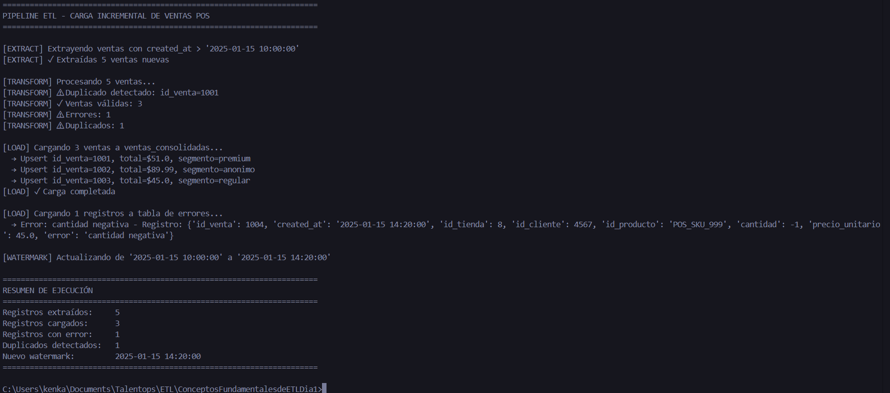
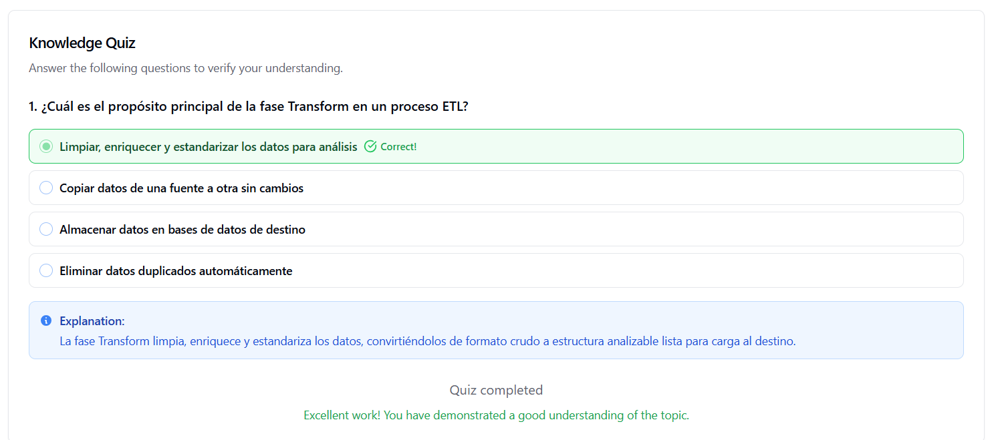

# Datasets y Scripts de Ejemplo - Pipeline ETL

Este documento complementa el diseño conceptual del pipeline ETL con **ejemplos prácticos** listos para ejecutar.

---

## 📁 Archivos incluidos

### 1. **Datos de ejemplo (CSV/JSON)**

| Archivo | Descripción | Registros | Descarga |
|---------|-------------|-----------|----------|
| `ventas_pos_ejemplo.csv` | Ventas del POS con diferentes escenarios | 7 ventas | [📥 Ver archivo](ventas-pos-ejemplo.csv) |
| `crm_clientes_ejemplo.csv` | Datos de clientes y segmentación | 5 clientes | [📥 Ver archivo](crm-clientes-ejemplo.csv) |
| `inventario_api_response.json` | Respuesta simulada de la API de inventario | 5 productos | [📥 Ver archivo](inventario-api-response.json) |
| `web_logs_ejemplo.json` | Logs de eventos del sitio web | 5 eventos | [📥 Ver archivo](web-logs-ejemplo.json) |

### 2. **Scripts**

| Archivo | Descripción | Lenguaje | Descarga |
|---------|-------------|----------|----------|
| `etl_demo_script.py` | Pipeline ETL completo con carga incremental | Python 3 | [📥 Ver archivo](#etl-demo-scriptpy) |
| `setup_warehouse.sql` | Creación de tablas del data warehouse | SQL (PostgreSQL) | [📥 Ver archivo](#setup-warehousesql) |

---

## 🚀 Cómo usar estos ejemplos

### Opción A: Ejecutar el script Python

```bash
# 1. Copiar el contenido de etl_demo_script.py (ver más abajo)
# 2. Guardar como etl_demo_script.py
# 3. Ejecutar (no requiere dependencias externas)
python etl_demo_script.py
```

**Salida esperada:**
```
======================================================================
PIPELINE ETL - CARGA INCREMENTAL DE VENTAS POS
======================================================================

[EXTRACT] Extrayendo ventas con created_at > '2025-01-15 10:00:00'
[EXTRACT] ✓ Extraídas 5 ventas nuevas

[TRANSFORM] Procesando 5 ventas...
[TRANSFORM] ⚠ Duplicado detectado: id_venta=1001
[TRANSFORM] ✓ Ventas válidas: 3
[TRANSFORM] ⚠ Errores: 1
[TRANSFORM] ⚠ Duplicados: 1

[LOAD] Cargando 3 ventas a ventas_consolidadas...
  → Upsert id_venta=1001, total=$51.0, segmento=premium
  → Upsert id_venta=1002, total=$89.99, segmento=anonimo
  → Upsert id_venta=1003, total=$45.0, segmento=regular
[LOAD] ✓ Carga completada

======================================================================
RESUMEN DE EJECUCIÓN
======================================================================
Registros extraídos:     5
Registros cargados:      3
Registros con error:     1
Duplicados detectados:   1
Nuevo watermark:         2025-01-15 14:20:00
======================================================================
```

### Opción B: Setup del data warehouse (PostgreSQL)

```bash
# 1. Conectarse a PostgreSQL
psql -U tu_usuario -d tu_database

# 2. Copiar y ejecutar el contenido de setup_warehouse.sql (ver más abajo)
\i setup_warehouse.sql

# 3. Verificar tablas creadas
\dt
```

---

## 📊 Estructura de los datos de ejemplo

### Ventas POS (`ventas_pos_ejemplo.csv`)

Incluye casos especiales para demostrar el manejo de:
- ✅ Ventas normales
- ⚠️ **Compras anónimas** (id_cliente nulo)
- 🔁 **Duplicados** (mismo id_venta)
- ❌ **Datos inválidos** (cantidad negativa)

```csv
id_venta,created_at,id_tienda,id_cliente,id_producto,cantidad,precio_unitario
1001,2025-01-15 11:30:00,5,2341,POS_SKU_789,2,25.50
1002,2025-01-15 12:15:00,3,,POS_SKU_456,1,89.99  ← compra anónima
1004,2025-01-15 14:20:00,8,4567,POS_SKU_999,-1,45.00  ← cantidad negativa (error)
```

### CRM Clientes (`crm_clientes_ejemplo.csv`)

Datos de segmentación para enriquecimiento:

```csv
id_cliente,nombre,email,segmento,fecha_actualizacion
2341,Ana García,ana.garcia@email.com,premium,2025-01-10
1523,Carlos López,carlos.lopez@email.com,regular,2025-01-10
```

### Inventario API (`inventario_api_response.json`)

Respuesta típica de una API REST:

```json
{
  "timestamp": "2025-01-15T18:00:00Z",
  "status": "success",
  "data": [
    {
      "id_producto": "INV_PROD_001",
      "sku_sistema": "POS_SKU_789",
      "ubicacion": "TIENDA_05",
      "stock": 150,
      "stock_minimo": 20
    }
  ]
}
```

### Web Logs (`web_logs_ejemplo.json`)

Eventos del sitio web que se correlacionan con ventas del POS:

```json
[
  {
    "event_type": "page_view",
    "timestamp": "2025-01-15T11:25:00.123Z",
    "session_id": "sess_abc123",
    "user_id": 2341,
    "page": "/productos/camisetas"
  },
  {
    "event_type": "purchase",
    "timestamp": "2025-01-15T11:30:15.789Z",
    "session_id": "sess_abc123",
    "user_id": 2341,
    "order_id": 1001,  ← correlaciona con POS
    "total_amount": 51.00
  }
]
```

---

## 🔍 Casos de prueba incluidos

El script de demostración maneja estos escenarios:

| Escenario | id_venta | Resultado esperado | Razón |
|-----------|----------|-------------------|-------|
| ✅ Venta válida | 1001 | Cargada exitosamente | Todos los campos correctos |
| 👤 Compra anónima | 1002 | Cargada como 'anonimo' | id_cliente es NULL |
| ✅ Venta válida | 1003 | Cargada exitosamente | Cliente con segmento 'regular' |
| 🔁 Duplicado | 1001 (repetido) | **Rechazada** | Mismo id_venta ya existe |
| ❌ Cantidad negativa | 1004 | **Error table** | cantidad = -1 (inválido) |

---

## 💡 Qué demuestra el script

### 1. **Extracción incremental (watermarking)**
```python
watermark = "2025-01-15 10:00:00"
nuevas_ventas = [v for v in VENTAS_POS if v["created_at"] > watermark]
```

### 2. **Transformaciones**
- ✅ Normalización de timestamps
- ✅ Cálculo de totales (`cantidad * precio_unitario`)
- ✅ Mapeo de SKUs a productos unificados
- ✅ Enriquecimiento con datos de CRM

### 3. **Validaciones de calidad**
```python
def validar_venta(venta):
    if venta["cantidad"] < 0:
        return False, "cantidad negativa"
    if venta["precio_unitario"] < 0:
        return False, "precio_unitario negativo"
    return True, None
```

### 4. **Detección de duplicados**
```python
# Por id_venta
if venta["id_venta"] in dedup_set:
    duplicados_detectados += 1
    continue

# Por hash de campos críticos
dedup_hash = hashlib.md5(f"{tienda}|{fecha}|{producto}|{cantidad}".encode()).hexdigest()
```

### 5. **Upsert (carga idempotente)**
```sql
INSERT INTO ventas_consolidadas (...)
VALUES (...)
ON CONFLICT (id_venta) DO UPDATE SET
    cantidad = EXCLUDED.cantidad,
    total_venta = EXCLUDED.total_venta;
```

---

## 📈 Consultas de ejemplo para análisis

Una vez cargados los datos, puedes ejecutar:

### Ventas por tienda
```sql
SELECT 
    t.nombre,
    COUNT(*) as num_ventas,
    SUM(v.total_venta) as total,
    AVG(v.total_venta) as ticket_promedio
FROM ventas_consolidadas v
JOIN dim_tienda t ON v.id_tienda = t.id_tienda
GROUP BY t.nombre
ORDER BY total DESC;
```

### Top productos
```sql
SELECT 
    p.nombre,
    p.categoria,
    SUM(v.cantidad) as unidades_vendidas,
    SUM(v.total_venta) as ingresos
FROM ventas_consolidadas v
JOIN dim_producto p ON v.id_producto = p.sku_unificado
GROUP BY p.nombre, p.categoria
ORDER BY ingresos DESC
LIMIT 10;
```

### Ventas por segmento de cliente
```sql
SELECT 
    segmento_cliente,
    COUNT(*) as num_transacciones,
    SUM(total_venta) as total,
    AVG(total_venta) as ticket_promedio
FROM ventas_consolidadas
GROUP BY segmento_cliente
ORDER BY total DESC;
```

### Productos con bajo inventario
```sql
SELECT 
    p.nombre,
    i.ubicacion,
    i.stock,
    i.stock_minimo,
    i.stock - i.stock_minimo as margen
FROM dim_inventario i
JOIN dim_producto p ON i.sku_unificado = p.sku_unificado
WHERE i.stock < i.stock_minimo * 1.5
ORDER BY margen ASC;
```

---

## 🛠️ Personalización

### Modificar el watermark
En `etl_demo_script.py`, cambia:
```python
WATERMARK = "2025-01-15 10:00:00"  # Ajustar según necesidad
```

### Añadir nuevos productos
En `setup_warehouse.sql`:
```sql
INSERT INTO dim_producto (sku_unificado, nombre, categoria, precio_sugerido) 
VALUES ('PROD_005', 'Pantalón Deportivo', 'Ropa', 65.00);
```

### Agregar mapeos de SKUs
```sql
INSERT INTO producto_map (sistema, id_sistema, sku_unificado) 
VALUES ('pos', 'POS_SKU_NEW', 'PROD_005');
```

---

## 📝 Notas técnicas

### Dependencias del script Python
- **Python 3.7+** (usa type hints y f-strings)
- **Librerías estándar únicamente**: csv, hashlib, datetime, typing
- **No requiere instalación** de paquetes externos

### Base de datos
El SQL está optimizado para **PostgreSQL 12+**, pero puede adaptarse fácilmente a:
- MySQL (cambiar sintaxis de `ON CONFLICT`)
- SQL Server (usar `MERGE`)
- Snowflake (usar `MERGE`)

---

## ✅ Checklist de validación

Usa esta lista para verificar que el pipeline funciona:

- [ ] Script Python ejecuta sin errores
- [ ] Se detectan 1 duplicado y 1 error
- [ ] Se cargan exactamente 3 ventas válidas
- [ ] El watermark se actualiza correctamente
- [ ] Las tablas SQL se crean sin errores
- [ ] Las foreign keys funcionan correctamente
- [ ] Los índices mejoran el performance de consultas
- [ ] Las vistas retornan datos correctos

---

## 🎯 Próximos pasos

1. **Integrar con Airflow**: Convertir el script en un DAG
2. **Añadir tests**: Usar pytest para pruebas automatizadas
3. **Implementar CDC**: Para captura de cambios en tiempo real
4. **Monitoreo**: Integrar con Prometheus/Grafana
5. **Alertas**: Configurar notificaciones por Slack/email

---

# 📥 ARCHIVOS COMPLETOS

## `ventas_pos_ejemplo.csv`

```csv
id_venta,created_at,id_tienda,id_cliente,id_producto,cantidad,precio_unitario
1001,2025-01-15 11:30:00,5,2341,POS_SKU_789,2,25.50
1002,2025-01-15 12:15:00,3,,POS_SKU_456,1,89.99
1003,2025-01-15 13:45:00,5,1523,POS_SKU_123,3,15.00
1004,2025-01-15 14:20:00,8,4567,POS_SKU_999,1,45.00
1005,2025-01-15 15:10:00,3,2341,POS_SKU_789,1,25.50
1006,2025-01-15 16:00:00,5,,POS_SKU_456,2,89.99
1007,2025-01-15 17:30:00,8,1523,POS_SKU_123,5,15.00
```


---

## `crm_clientes_ejemplo.csv`

```csv
id_cliente,nombre,email,segmento,fecha_actualizacion
2341,Ana García,ana.garcia@email.com,premium,2025-01-10
1523,Carlos López,carlos.lopez@email.com,regular,2025-01-10
4567,María Rodríguez,maria.rodriguez@email.com,vip,2025-01-10
7890,Pedro Sánchez,pedro.sanchez@email.com,regular,2025-01-10
3456,Laura Martínez,laura.martinez@email.com,premium,2025-01-10
```


---

## `inventario_api_response.json`

```json
{
  "timestamp": "2025-01-15T18:00:00Z",
  "status": "success",
  "data": [
    {
      "id_producto": "INV_PROD_001",
      "sku_sistema": "POS_SKU_789",
      "ubicacion": "TIENDA_05",
      "stock": 150,
      "stock_minimo": 20,
      "ultima_actualizacion": "2025-01-15T17:45:00Z"
    },
    {
      "id_producto": "INV_PROD_002",
      "sku_sistema": "POS_SKU_456",
      "ubicacion": "TIENDA_03",
      "stock": 45,
      "stock_minimo": 10,
      "ultima_actualizacion": "2025-01-15T17:45:00Z"
    },
    {
      "id_producto": "INV_PROD_003",
      "sku_sistema": "POS_SKU_123",
      "ubicacion": "TIENDA_05",
      "stock": 320,
      "stock_minimo": 50,
      "ultima_actualizacion": "2025-01-15T17:45:00Z"
    },
    {
      "id_producto": "INV_PROD_004",
      "sku_sistema": "POS_SKU_999",
      "ubicacion": "TIENDA_08",
      "stock": 78,
      "stock_minimo": 15,
      "ultima_actualizacion": "2025-01-15T17:45:00Z"
    },
    {
      "id_producto": "INV_PROD_001",
      "sku_sistema": "POS_SKU_789",
      "ubicacion": "ALMACEN_CENTRAL",
      "stock": 500,
      "stock_minimo": 100,
      "ultima_actualizacion": "2025-01-15T17:45:00Z"
    }
  ]
}
```


---

## `web_logs_ejemplo.json`

```json
[
  {
    "event_type": "page_view",
    "timestamp": "2025-01-15T11:25:00.123Z",
    "session_id": "sess_abc123",
    "user_id": 2341,
    "page": "/productos/camisetas",
    "referrer": "https://google.com",
    "device": "mobile"
  },
  {
    "event_type": "add_to_cart",
    "timestamp": "2025-01-15T11:28:30.456Z",
    "session_id": "sess_abc123",
    "user_id": 2341,
    "product_id": "POS_SKU_789",
    "quantity": 2,
    "device": "mobile"
  },
  {
    "event_type": "purchase",
    "timestamp": "2025-01-15T11:30:15.789Z",
    "session_id": "sess_abc123",
    "user_id": 2341,
    "order_id": 1001,
    "total_amount": 51.00,
    "payment_method": "credit_card",
    "items": [
      {
        "product_id": "POS_SKU_789",
        "quantity": 2,
        "price": 25.50
      }
    ],
    "device": "mobile"
  },
  {
    "event_type": "page_view",
    "timestamp": "2025-01-15T12:10:00.234Z",
    "session_id": "sess_xyz789",
    "user_id": null,
    "page": "/productos/zapatillas",
    "referrer": "direct",
    "device": "desktop"
  },
  {
    "event_type": "purchase",
    "timestamp": "2025-01-15T12:15:45.567Z",
    "session_id": "sess_xyz789",
    "user_id": null,
    "order_id": 1002,
    "total_amount": 89.99,
    "payment_method": "paypal",
    "items": [
      {
        "product_id": "POS_SKU_456",
        "quantity": 1,
        "price": 89.99
      }
    ],
    "device": "desktop"
  }
]
```

---

## `etl_demo_script.py`

```python
#!/usr/bin/env python3
"""
Script de demostración de carga incremental para el pipeline ETL
Simula la extracción, transformación y carga de ventas desde el POS
"""

import csv
import hashlib
from datetime import datetime
from typing import Dict, List, Optional

# =============================================================================
# CONFIGURACIÓN Y DATOS DE EJEMPLO
# =============================================================================

# Simular watermark (última fecha procesada)
WATERMARK = "2025-01-15 10:00:00"

# Datos de ejemplo del POS (ventas nuevas desde el watermark)
VENTAS_POS = [
    {
        "id_venta": 1001,
        "created_at": "2025-01-15 11:30:00",
        "id_tienda": 5,
        "id_cliente": 2341,
        "id_producto": "POS_SKU_789",
        "cantidad": 2,
        "precio_unitario": 25.50
    },
    {
        "id_venta": 1002,
        "created_at": "2025-01-15 12:15:00",
        "id_tienda": 3,
        "id_cliente": None,  # Compra anónima
        "id_producto": "POS_SKU_456",
        "cantidad": 1,
        "precio_unitario": 89.99
    },
    {
        "id_venta": 1003,
        "created_at": "2025-01-15 13:45:00",
        "id_tienda": 5,
        "id_cliente": 1523,
        "id_producto": "POS_SKU_123",
        "cantidad": 3,
        "precio_unitario": 15.00
    },
    {
        "id_venta": 1001,  # DUPLICADO - mismo id_venta
        "created_at": "2025-01-15 11:30:00",
        "id_tienda": 5,
        "id_cliente": 2341,
        "id_producto": "POS_SKU_789",
        "cantidad": 2,
        "precio_unitario": 25.50
    },
    {
        "id_venta": 1004,
        "created_at": "2025-01-15 14:20:00",
        "id_tienda": 8,
        "id_cliente": 4567,
        "id_producto": "POS_SKU_999",
        "cantidad": -1,  # ERROR: cantidad negativa
        "precio_unitario": 45.00
    }
]

# Mapeo de productos (normalización de SKUs)
PRODUCTO_MAP = {
    "POS_SKU_789": {"sku_unificado": "PROD_001", "nombre": "Camiseta Básica"},
    "POS_SKU_456": {"sku_unificado": "PROD_002", "nombre": "Zapatillas Running"},
    "POS_SKU_123": {"sku_unificado": "PROD_003", "nombre": "Calcetines Pack 3"},
    "POS_SKU_999": {"sku_unificado": "PROD_004", "nombre": "Gorra Deportiva"}
}

# Datos de CRM (segmentación de clientes)
CRM_DATA = {
    2341: {"nombre": "Ana García", "segmento": "premium", "email": "ana.g@email.com"},
    1523: {"nombre": "Carlos López", "segmento": "regular", "email": "carlos.l@email.com"},
    4567: {"nombre": "María Rodríguez", "segmento": "vip", "email": "maria.r@email.com"}
}

# =============================================================================
# FUNCIONES DE TRANSFORMACIÓN
# =============================================================================

def normalize_timestamp(ts_str: str) -> str:
    """Convierte timestamp a formato estándar UTC"""
    dt = datetime.strptime(ts_str, "%Y-%m-%d %H:%M:%S")
    return dt.strftime("%Y-%m-%d")

def map_producto(id_producto: str, sistema: str = "pos") -> Optional[Dict]:
    """Mapea SKU del sistema origen a SKU unificado"""
    return PRODUCTO_MAP.get(id_producto)

def lookup_segmento(id_cliente: Optional[int]) -> str:
    """Busca segmento del cliente en CRM"""
    if id_cliente is None:
        return "anonimo"
    cliente = CRM_DATA.get(id_cliente, {})
    return cliente.get("segmento", "sin_clasificar")

def calcular_dedup_hash(venta: Dict) -> str:
    """Calcula hash para detección de duplicados"""
    # Crear string con campos críticos
    dedup_str = f"{venta['id_tienda']}|{venta['fecha_venta']}|{venta['id_producto']}|{venta['cantidad']}|{venta['total_venta']}"
    return hashlib.md5(dedup_str.encode()).hexdigest()

def validar_venta(venta: Dict) -> tuple[bool, Optional[str]]:
    """Valida reglas de negocio"""
    # Validar campos requeridos
    if venta["id_producto"] is None:
        return False, "id_producto es nulo"
    
    if venta["cantidad"] is None:
        return False, "cantidad es nula"
    
    # Validar rangos
    if venta["cantidad"] < 0:
        return False, "cantidad negativa"
    
    if venta["precio_unitario"] < 0:
        return False, "precio_unitario negativo"
    
    return True, None

# =============================================================================
# PIPELINE ETL
# =============================================================================

def extract_ventas_incrementales(watermark: str) -> List[Dict]:
    """Extrae ventas nuevas desde el watermark"""
    print(f"\n[EXTRACT] Extrayendo ventas con created_at > '{watermark}'")
    
    nuevas_ventas = [
        v for v in VENTAS_POS 
        if v["created_at"] > watermark
    ]
    
    print(f"[EXTRACT] ✓ Extraídas {len(nuevas_ventas)} ventas nuevas")
    return nuevas_ventas

def transform_ventas(ventas: List[Dict]) -> tuple[List[Dict], List[Dict]]:
    """Transforma y limpia ventas"""
    print(f"\n[TRANSFORM] Procesando {len(ventas)} ventas...")
    
    ventas_validas = []
    ventas_error = []
    dedup_set = set()
    duplicados_detectados = 0
    
    for venta in ventas:
        # 1. Normalizar timestamp
        fecha_venta = normalize_timestamp(venta["created_at"])
        
        # 2. Calcular total
        total_venta = venta["cantidad"] * venta["precio_unitario"]
        
        # 3. Mapear producto
        producto_info = map_producto(venta["id_producto"])
        if not producto_info:
            ventas_error.append({
                **venta,
                "error": f"Producto {venta['id_producto']} no encontrado en mapeo"
            })
            continue
        
        # 4. Enriquecer con CRM
        segmento_cliente = lookup_segmento(venta["id_cliente"])
        
        # 5. Crear registro transformado
        venta_transformada = {
            "id_venta": venta["id_venta"],
            "fecha_venta": fecha_venta,
            "id_tienda": venta["id_tienda"],
            "id_cliente": venta["id_cliente"],
            "id_producto": producto_info["sku_unificado"],
            "cantidad": venta["cantidad"],
            "precio_unitario": venta["precio_unitario"],
            "total_venta": round(total_venta, 2),
            "canal_venta": "tienda",
            "segmento_cliente": segmento_cliente,
            "created_at": venta["created_at"],
            "fuente": "pos"
        }
        
        # 6. Calcular hash para deduplicación
        dedup_hash = calcular_dedup_hash(venta_transformada)
        venta_transformada["dedup_hash"] = dedup_hash
        
        # 7. Validar
        es_valida, error_msg = validar_venta(venta_transformada)
        if not es_valida:
            ventas_error.append({
                **venta,
                "error": error_msg
            })
            continue
        
        # 8. Detectar duplicados
        if venta_transformada["id_venta"] in dedup_set:
            duplicados_detectados += 1
            print(f"[TRANSFORM] ⚠ Duplicado detectado: id_venta={venta_transformada['id_venta']}")
            continue
        
        dedup_set.add(venta_transformada["id_venta"])
        ventas_validas.append(venta_transformada)
    
    print(f"[TRANSFORM] ✓ Ventas válidas: {len(ventas_validas)}")
    print(f"[TRANSFORM] ⚠ Errores: {len(ventas_error)}")
    print(f"[TRANSFORM] ⚠ Duplicados: {duplicados_detectados}")
    
    return ventas_validas, ventas_error

def load_to_warehouse(ventas: List[Dict], errores: List[Dict]):
    """Simula carga al data warehouse (upsert)"""
    print(f"\n[LOAD] Cargando {len(ventas)} ventas a ventas_consolidadas...")
    
    # Simular upsert SQL
    for venta in ventas:
        sql = f"""
        INSERT INTO ventas_consolidadas 
        (id_venta, fecha_venta, id_tienda, id_cliente, id_producto, 
         cantidad, precio_unitario, total_venta, canal_venta, 
         segmento_cliente, created_at, fuente, dedup_hash)
        VALUES 
        ({venta['id_venta']}, '{venta['fecha_venta']}', {venta['id_tienda']}, 
         {venta['id_cliente']}, '{venta['id_producto']}', {venta['cantidad']}, 
         {venta['precio_unitario']}, {venta['total_venta']}, '{venta['canal_venta']}', 
         '{venta['segmento_cliente']}', '{venta['created_at']}', '{venta['fuente']}',
         '{venta['dedup_hash']}')
        ON CONFLICT (id_venta) DO UPDATE SET
            cantidad = EXCLUDED.cantidad,
            total_venta = EXCLUDED.total_venta,
            segmento_cliente = EXCLUDED.segmento_cliente;
        """
        print(f"  → Upsert id_venta={venta['id_venta']}, total=${venta['total_venta']}, segmento={venta['segmento_cliente']}")
    
    print(f"[LOAD] ✓ Carga completada")
    
    # Cargar errores a tabla de errores
    if errores:
        print(f"\n[LOAD] Cargando {len(errores)} registros a tabla de errores...")
        for error in errores:
            print(f"  → Error: {error.get('error', 'desconocido')} - Registro: {error}")

def actualizar_watermark(ventas: List[Dict]) -> str:
    """Actualiza watermark a la última fecha procesada"""
    if not ventas:
        return WATERMARK
    
    max_timestamp = max(v["created_at"] for v in ventas)
    print(f"\n[WATERMARK] Actualizando de '{WATERMARK}' a '{max_timestamp}'")
    return max_timestamp

# =============================================================================
# EJECUCIÓN PRINCIPAL
# =============================================================================

def main():
    print("="*70)
    print("PIPELINE ETL - CARGA INCREMENTAL DE VENTAS POS")
    print("="*70)
    
    # 1. Extract
    ventas_nuevas = extract_ventas_incrementales(WATERMARK)
    
    if not ventas_nuevas:
        print("\n[INFO] No hay ventas nuevas para procesar")
        return
    
    # 2. Transform
    ventas_validas, ventas_error = transform_ventas(ventas_nuevas)
    
    # 3. Load
    load_to_warehouse(ventas_validas, ventas_error)
    
    # 4. Update watermark
    nuevo_watermark = actualizar_watermark(ventas_nuevas)
    
    # 5. Resumen
    print("\n" + "="*70)
    print("RESUMEN DE EJECUCIÓN")
    print("="*70)
    print(f"Registros extraídos:     {len(ventas_nuevas)}")
    print(f"Registros cargados:      {len(ventas_validas)}")
    print(f"Registros con error:     {len(ventas_error)}")
    print(f"Duplicados detectados:   {len(ventas_nuevas) - len(ventas_validas) - len(ventas_error)}")
    print(f"Nuevo watermark:         {nuevo_watermark}")
    print("="*70)

if __name__ == "__main__":
    main()
```


---

## `setup_warehouse.sql`

```sql
-- ============================================================================
-- SCRIPT DE SETUP DEL DATA WAREHOUSE
-- Crear las tablas de hechos y dimensiones para el pipeline ETL
-- ============================================================================

-- Tabla de hechos principal
CREATE TABLE IF NOT EXISTS ventas_consolidadas (
    id_venta INTEGER PRIMARY KEY,
    fecha_venta DATE NOT NULL,
    id_tienda INTEGER NOT NULL,
    id_cliente INTEGER,
    id_producto VARCHAR(50) NOT NULL,
    cantidad INTEGER NOT NULL CHECK (cantidad >= 0),
    precio_unitario DECIMAL(10,2) NOT NULL CHECK (precio_unitario >= 0),
    total_venta DECIMAL(10,2) NOT NULL,
    canal_venta VARCHAR(20) NOT NULL CHECK (canal_venta IN ('online', 'tienda')),
    segmento_cliente VARCHAR(20),
    created_at TIMESTAMP NOT NULL,
    fuente VARCHAR(20) NOT NULL CHECK (fuente IN ('pos', 'web', 'otros')),
    dedup_hash VARCHAR(32),
    carga_timestamp TIMESTAMP DEFAULT CURRENT_TIMESTAMP,
    
    CONSTRAINT fk_tienda FOREIGN KEY (id_tienda) REFERENCES dim_tienda(id_tienda),
    CONSTRAINT fk_producto FOREIGN KEY (id_producto) REFERENCES dim_producto(sku_unificado),
    CONSTRAINT fk_cliente FOREIGN KEY (id_cliente) REFERENCES dim_cliente(id_cliente),
    CONSTRAINT fk_fecha FOREIGN KEY (fecha_venta) REFERENCES dim_fecha(fecha)
);

-- Índices para mejorar performance
CREATE INDEX idx_ventas_fecha ON ventas_consolidadas(fecha_venta);
CREATE INDEX idx_ventas_tienda ON ventas_consolidadas(id_tienda);
CREATE INDEX idx_ventas_producto ON ventas_consolidadas(id_producto);
CREATE INDEX idx_ventas_cliente ON ventas_consolidadas(id_cliente);
CREATE INDEX idx_ventas_dedup ON ventas_consolidadas(dedup_hash);
CREATE INDEX idx_ventas_created_at ON ventas_consolidadas(created_at);

-- ============================================================================
-- TABLAS DIMENSIONALES
-- ============================================================================

-- Dimensión de tiendas
CREATE TABLE IF NOT EXISTS dim_tienda (
    id_tienda INTEGER PRIMARY KEY,
    nombre VARCHAR(100) NOT NULL,
    region VARCHAR(50),
    ciudad VARCHAR(50),
    tipo VARCHAR(30) CHECK (tipo IN ('flagship', 'outlet', 'pop-up', 'regular')),
    fecha_apertura DATE,
    activa BOOLEAN DEFAULT TRUE,
    ultima_actualizacion TIMESTAMP DEFAULT CURRENT_TIMESTAMP
);

-- Datos de ejemplo para dim_tienda
INSERT INTO dim_tienda (id_tienda, nombre, region, ciudad, tipo, fecha_apertura) VALUES
(3, 'Tienda Centro', 'Metropolitana', 'Santiago', 'flagship', '2020-01-15'),
(5, 'Tienda Mall Plaza', 'Metropolitana', 'Santiago', 'regular', '2019-05-20'),
(8, 'Outlet Viña', 'Valparaíso', 'Viña del Mar', 'outlet', '2021-03-10')
ON CONFLICT (id_tienda) DO NOTHING;

-- Dimensión de productos
CREATE TABLE IF NOT EXISTS dim_producto (
    sku_unificado VARCHAR(50) PRIMARY KEY,
    nombre VARCHAR(200) NOT NULL,
    categoria VARCHAR(50),
    subcategoria VARCHAR(50),
    marca VARCHAR(50),
    precio_sugerido DECIMAL(10,2),
    activo BOOLEAN DEFAULT TRUE,
    ultima_actualizacion TIMESTAMP DEFAULT CURRENT_TIMESTAMP
);

-- Datos de ejemplo para dim_producto
INSERT INTO dim_producto (sku_unificado, nombre, categoria, subcategoria, marca, precio_sugerido) VALUES
('PROD_001', 'Camiseta Básica', 'Ropa', 'Camisetas', 'BasicWear', 25.50),
('PROD_002', 'Zapatillas Running', 'Calzado', 'Deportivo', 'SportMax', 89.99),
('PROD_003', 'Calcetines Pack 3', 'Accesorios', 'Calcetería', 'ComfortPlus', 15.00),
('PROD_004', 'Gorra Deportiva', 'Accesorios', 'Gorras', 'SportMax', 45.00)
ON CONFLICT (sku_unificado) DO NOTHING;

-- Dimensión de clientes
CREATE TABLE IF NOT EXISTS dim_cliente (
    id_cliente INTEGER PRIMARY KEY,
    nombre VARCHAR(100),
    email VARCHAR(150),
    segmento VARCHAR(20) CHECK (segmento IN ('vip', 'premium', 'regular', 'nuevo', 'sin_clasificar', 'anonimo')),
    fecha_registro DATE,
    activo BOOLEAN DEFAULT TRUE,
    ultima_actualizacion TIMESTAMP DEFAULT CURRENT_TIMESTAMP
);

-- Datos de ejemplo para dim_cliente
INSERT INTO dim_cliente (id_cliente, nombre, email, segmento, fecha_registro) VALUES
(2341, 'Ana García', 'ana.garcia@email.com', 'premium', '2022-03-15'),
(1523, 'Carlos López', 'carlos.lopez@email.com', 'regular', '2023-01-20'),
(4567, 'María Rodríguez', 'maria.rodriguez@email.com', 'vip', '2021-11-05')
ON CONFLICT (id_cliente) DO NOTHING;

-- Dimensión de fecha (tabla calendario)
CREATE TABLE IF NOT EXISTS dim_fecha (
    fecha DATE PRIMARY KEY,
    anio INTEGER NOT NULL,
    mes INTEGER NOT NULL CHECK (mes BETWEEN 1 AND 12),
    dia INTEGER NOT NULL CHECK (dia BETWEEN 1 AND 31),
    trimestre INTEGER NOT NULL CHECK (trimestre BETWEEN 1 AND 4),
    semana INTEGER NOT NULL,
    dia_semana INTEGER NOT NULL CHECK (dia_semana BETWEEN 1 AND 7),
    nombre_dia VARCHAR(20),
    nombre_mes VARCHAR(20),
    es_fin_semana BOOLEAN,
    es_festivo BOOLEAN DEFAULT FALSE,
    nombre_festivo VARCHAR(100)
);

-- Procedimiento para poblar dim_fecha (ejemplo simplificado)
-- En producción, esto debería generar varios años de datos
INSERT INTO dim_fecha (fecha, anio, mes, dia, trimestre, semana, dia_semana, nombre_dia, nombre_mes, es_fin_semana)
SELECT 
    fecha,
    EXTRACT(YEAR FROM fecha) as anio,
    EXTRACT(MONTH FROM fecha) as mes,
    EXTRACT(DAY FROM fecha) as dia,
    EXTRACT(QUARTER FROM fecha) as trimestre,
    EXTRACT(WEEK FROM fecha) as semana,
    EXTRACT(DOW FROM fecha) + 1 as dia_semana,
    TO_CHAR(fecha, 'Day') as nombre_dia,
    TO_CHAR(fecha, 'Month') as nombre_mes,
    EXTRACT(DOW FROM fecha) IN (0, 6) as es_fin_semana
FROM generate_series('2025-01-01'::date, '2025-12-31'::date, '1 day'::interval) fecha
ON CONFLICT (fecha) DO NOTHING;

-- ============================================================================
-- TABLA DE MAPEO DE PRODUCTOS (para normalización de SKUs)
-- ============================================================================

CREATE TABLE IF NOT EXISTS producto_map (
    id_mapeo SERIAL PRIMARY KEY,
    sistema VARCHAR(50) NOT NULL,
    id_sistema VARCHAR(100) NOT NULL,
    sku_unificado VARCHAR(50) NOT NULL,
    activo BOOLEAN DEFAULT TRUE,
    fecha_creacion TIMESTAMP DEFAULT CURRENT_TIMESTAMP,
    
    UNIQUE(sistema, id_sistema),
    CONSTRAINT fk_producto_unificado FOREIGN KEY (sku_unificado) REFERENCES dim_producto(sku_unificado)
);

-- Datos de ejemplo para mapeo
INSERT INTO producto_map (sistema, id_sistema, sku_unificado) VALUES
('pos', 'POS_SKU_789', 'PROD_001'),
('pos', 'POS_SKU_456', 'PROD_002'),
('pos', 'POS_SKU_123', 'PROD_003'),
('pos', 'POS_SKU_999', 'PROD_004'),
('inventario', 'INV_PROD_001', 'PROD_001'),
('inventario', 'INV_PROD_002', 'PROD_002'),
('inventario', 'INV_PROD_003', 'PROD_003'),
('inventario', 'INV_PROD_004', 'PROD_004')
ON CONFLICT (sistema, id_sistema) DO NOTHING;

-- ============================================================================
-- TABLA DE ERRORES (para auditoría)
-- ============================================================================

CREATE TABLE IF NOT EXISTS staging_errors (
    id_error SERIAL PRIMARY KEY,
    fuente VARCHAR(50) NOT NULL,
    registro_json JSONB NOT NULL,
    error_descripcion TEXT NOT NULL,
    error_timestamp TIMESTAMP DEFAULT CURRENT_TIMESTAMP,
    procesado BOOLEAN DEFAULT FALSE
);

CREATE INDEX idx_errors_timestamp ON staging_errors(error_timestamp);
CREATE INDEX idx_errors_fuente ON staging_errors(fuente);

-- ============================================================================
-- TABLA DE WATERMARKS (para cargas incrementales)
-- ============================================================================

CREATE TABLE IF NOT EXISTS etl_watermarks (
    fuente VARCHAR(50) PRIMARY KEY,
    ultimo_timestamp TIMESTAMP NOT NULL,
    ultima_actualizacion TIMESTAMP DEFAULT CURRENT_TIMESTAMP,
    registros_procesados INTEGER DEFAULT 0
);

-- Inicializar watermarks
INSERT INTO etl_watermarks (fuente, ultimo_timestamp) VALUES
('pos_ventas', '2025-01-15 10:00:00'),
('web_logs', '2025-01-15 00:00:00'),
('inventario', '2025-01-14 00:00:00'),
('crm', '2025-01-08 00:00:00')
ON CONFLICT (fuente) DO NOTHING;

-- ============================================================================
-- TABLA DE INVENTARIO (snapshot diario)
-- ============================================================================

CREATE TABLE IF NOT EXISTS dim_inventario (
    id_inventario SERIAL PRIMARY KEY,
    sku_unificado VARCHAR(50) NOT NULL,
    ubicacion VARCHAR(50) NOT NULL,
    stock INTEGER NOT NULL CHECK (stock >= 0),
    stock_minimo INTEGER,
    fecha_snapshot DATE NOT NULL,
    
    UNIQUE(sku_unificado, ubicacion, fecha_snapshot),
    CONSTRAINT fk_inv_producto FOREIGN KEY (sku_unificado) REFERENCES dim_producto(sku_unificado)
);

CREATE INDEX idx_inventario_fecha ON dim_inventario(fecha_snapshot);
CREATE INDEX idx_inventario_sku ON dim_inventario(sku_unificado);

-- ============================================================================
-- VISTAS ÚTILES PARA ANÁLISIS
-- ============================================================================

-- Vista de ventas enriquecidas
CREATE OR REPLACE VIEW v_ventas_detalle AS
SELECT 
    v.id_venta,
    v.fecha_venta,
    f.nombre_mes,
    f.anio,
    f.trimestre,
    f.es_fin_semana,
    t.nombre as nombre_tienda,
    t.region,
    t.ciudad,
    c.nombre as nombre_cliente,
    c.email,
    v.segmento_cliente,
    p.nombre as nombre_producto,
    p.categoria,
    p.marca,
    v.cantidad,
    v.precio_unitario,
    v.total_venta,
    v.canal_venta,
    v.fuente
FROM ventas_consolidadas v
LEFT JOIN dim_fecha f ON v.fecha_venta = f.fecha
LEFT JOIN dim_tienda t ON v.id_tienda = t.id_tienda
LEFT JOIN dim_cliente c ON v.id_cliente = c.id_cliente
LEFT JOIN dim_producto p ON v.id_producto = p.sku_unificado;

-- Vista de resumen de ventas por día y tienda
CREATE OR REPLACE VIEW v_ventas_resumen_diario AS
SELECT 
    fecha_venta,
    id_tienda,
    COUNT(*) as num_transacciones,
    SUM(cantidad) as unidades_vendidas,
    SUM(total_venta) as total_ventas,
    AVG(total_venta) as ticket_promedio,
    COUNT(DISTINCT id_cliente) as clientes_unicos
FROM ventas_consolidadas
GROUP BY fecha_venta, id_tienda;

-- ============================================================================
-- COMENTARIOS EN TABLAS (documentación)
-- ============================================================================

COMMENT ON TABLE ventas_consolidadas IS 'Tabla de hechos principal con todas las ventas consolidadas de diferentes fuentes';
COMMENT ON COLUMN ventas_consolidadas.dedup_hash IS 'Hash MD5 para detección de duplicados basado en campos críticos';
COMMENT ON COLUMN ventas_consolidadas.fuente IS 'Sistema origen: pos, web, otros';

COMMENT ON TABLE dim_fecha IS 'Dimensión calendario con todos los días del año y atributos temporales';
COMMENT ON TABLE producto_map IS 'Mapeo de SKUs entre diferentes sistemas al SKU unificado';
COMMENT ON TABLE etl_watermarks IS 'Marcas de agua para cargas incrementales por fuente';

-- ============================================================================
-- SCRIPT COMPLETADO
-- ============================================================================

SELECT 'Setup completado exitosamente' as mensaje;

```

###  Quiz del Dia 1 



